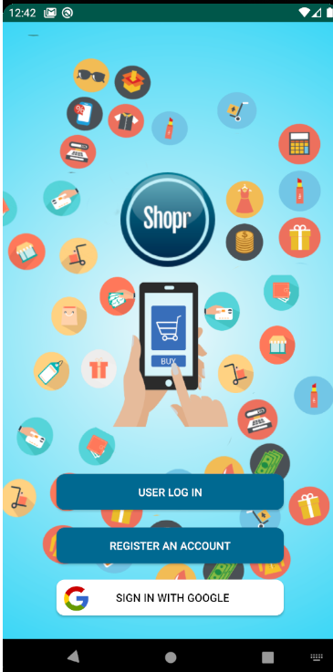
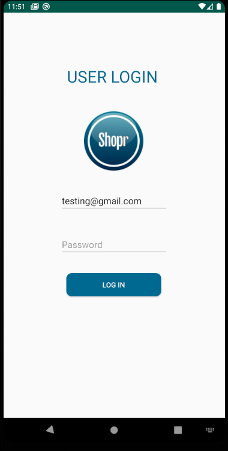
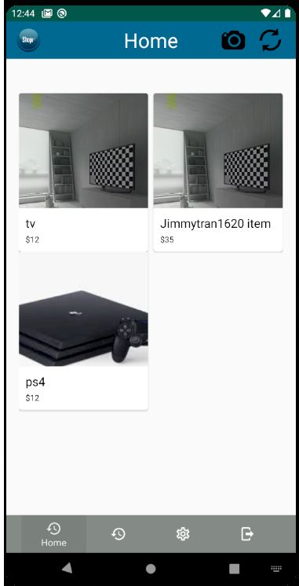
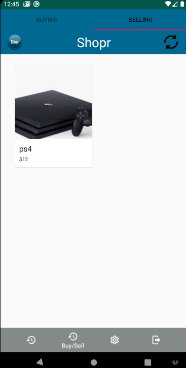

# Shopr 

<b>Android Mobile App - Marketplace</b>

 
-Integerated the Firebase API for server-side configurations - real-time database storage, and user authentication

-Main page for User to log in, or register

-Google sign-in feature to log into application using your pre-exisiting google account

-When user logs in, they are able to upload an item that they want to sell and it will automatically be saved to the realtime database.

-User's UI includes feeds of other user's sellings , settings page (profile), and a Sellings/Buyings page that keeps track of what you are selling and what you want to buy

-User are able to delete their post 

# Main page

# Login page

# User's Home Page

# Buying - Selling Page

